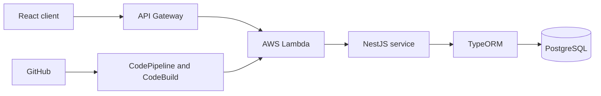

# Topinion Backend

[](https://github.com/AEVegaEngineer/topinia-backend/actions/workflows/test.yml)
[](LICENSE)

A NestJS backend for a social opinion platform, organized as an Nx service and designed to run locally with PostgreSQL or on AWS Lambda behind API Gateway.

The current implementation concentrates on user and topic management. Additional opinion-domain entities and modules show the broader product direction but are not all exposed as completed API capabilities.

## System context



## Repository structure

- **NestJS modules:** users and topics, with DTO, controller, service, and entity boundaries
- **Persistence:** TypeORM with PostgreSQL
- **Serverless adapter:** AWS Lambda handler through Vendia Serverless Express
- **Local environment:** Docker Compose database and direct NestJS server
- **Deployment artifacts:** AWS SAM template and CodeBuild specification
- **Automated tests:** service and controller tests with Jest

## Run locally

Requirements:

- Node.js 20
- Docker

```bash
cp .env.template .env
docker compose up -d
npm ci
npm run start:dev
```

The service uses port 4000 by default. Configure the following database variables in the local environment file:

```env
DB_HOST=localhost
DB_PORT=5432
DB_NAME=topinion
DB_USERNAME=postgres
DB_PASSWORD=change-me
STAGE=dev
```

## Verification

```bash
npm test -- --runInBand
npm run build:opinion-management
```

## Deployment

The production build is packaged for AWS Lambda with AWS SAM. The related Terraform repository provisions the surrounding AWS delivery and hosting infrastructure.

```bash
npm run build:opinion-management
sam build
sam local start-api
```

## Engineering decisions

- NestJS modules keep domain capabilities independently testable.
- DTO and entity types separate API inputs from persistence concerns.
- The Lambda adapter allows the same application module to run locally and behind API Gateway.
- Infrastructure is maintained separately so application and platform changes can evolve independently.

## Current limitations

- TypeORM schema synchronization is enabled for the current development setup; production should use reviewed migrations.
- Authentication, authorization, API documentation, and operational telemetry need completion before production use.
- Several opinion-domain entities are scaffolding rather than completed public endpoints.
- The AWS SAM template should be consolidated to one deployable function before a production release.
- The current NestJS/Nx dependency line still reports transitive production advisories; resolving the remainder requires a deliberate major-framework upgrade.

## Related repositories

- [Topinia Web](https://github.com/AEVegaEngineer/Topinia-web) — React, Vite, Redux, and MUI client
- [Topinia Infrastructure](https://github.com/AEVegaEngineer/Topinia-infra) — Terraform modules for API Gateway, Lambda, CodeBuild, CodePipeline, S3, CloudFront, Cognito, Route 53, and ACM

## License

MIT
